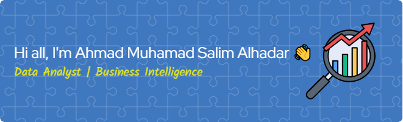

<!--
**AhmadMSA13/AhmadMSA13** is a ✨ _special_ ✨ repository because its `README.md` (this file) appears on your GitHub profile.

Here are some ideas to get you started:

- 🔭 I’m currently working on ...
- 🌱 I’m currently learning ...
- 👯 I’m looking to collaborate on ...
- 🤔 I’m looking for help with ...
- 💬 Ask me about ...
- 📫 How to reach me: ...
- 😄 Pronouns: ...
- ⚡ Fun fact: ...
-->
---

* 🎓 Recent Informatics graduate with a strong interest in data analytics
* 🔍 Skilled in turning data into insights through analysis and visualization
* 📚 Completed various learning programs and projects focused on:

  * Data cleaning and preprocessing
  * Exploratory data analysis
  * Data visualization and reporting
* 💻 Technical skills:

  * **Spreadsheet & BI Tools**: 
  
      

  * **Programming & Libraries**: 
  
       

  * **Databases**: 
  
      

  * **Productivity Tools**: 
  
     

* Other Tools & Technologies *(Non-core Data Analyst)*: 

    
     
  

* 🚀 Open to **full-time job opportunities** and **internships** in **Data Analyst** or **Business Intelligence** roles

* 🌱 Eager to learn, grow, and contribute in data-driven environments

* 🧾 My Projects :

* 📫 How to reach me: 

  

---

<h2 align="left">Play games with me</h2>

###

###